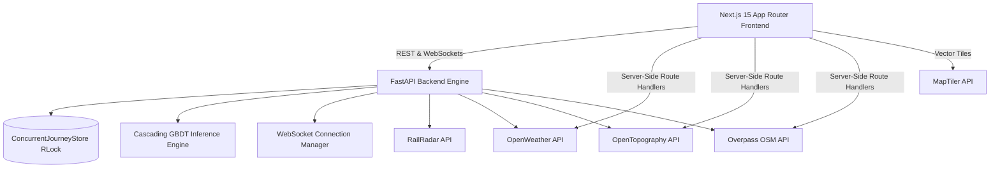

# RailETA — Product Specification & Technical Architecture

**Smart India Hackathon 2026 — Problem Statement 26028**  
*Dynamic Forecast of Expected Time of Arrival (ETA) for Indian Railways Coaching Trains*

---

## 1. Product Vision

### 1.1 Product Overview
RailETA is a next-generation, explainable Expected Time of Arrival (ETA) forecasting engine and travel intelligence platform for Indian Railways coaching trains. It replaces static schedule + delay heuristics with a cascading 20-feature Gradient Boosted Decision Tree (GBDT) machine learning model, live atmospheric telemetry (OpenWeather), real-time digital elevation modeling (OpenTopography SRTM DEM), and dynamic geographical point-of-interest mapping (OpenStreetMap Overpass API).

### 1.2 Problem Statement (SIH 26028)
Static timetable projections fail to capture section-level velocity changes, weather restrictions, junction crossovers, and tractive topography. Passengers and railway operators require:
1. Dynamic, continuously updating ETAs for every intermediate station and terminus.
2. Transparent explainability for *why* an arrival time shifted (delay recovery vs compounding).
3. Zero data leakage at prediction time $T$ (strict temporal separation).

### 1.3 Target Audience
- **Everyday Passengers**: Seeking instant clarity on "How much *more* time until my specific stop?", track progress, and live onboard scenic sights.
- **Station Masters & Section Controllers**: Needing high-precision downstream arrival windows, disruption simulation ("What-If" injection), and section headway telemetry.
- **AI Evaluators & Operations Analysts**: Inspecting feature contributions (SHAP TreeExplainer), residual bounds ($\pm 2.5\text{ min}$), and data provenance.

### 1.4 Goals
- **Sub-Minute Precision**: Maintain $< 3.5\text{ min}$ Mean Absolute Error (MAE) across 500+ km multi-section corridors.
- **Sub-50ms Inference**: Deliver live downstream ETAs via WebSockets and HTTP in $< 50\text{ ms}$.
- **Zero Fabrication**: 100% dynamic API integration with RailRadar, MapTiler, OpenWeather, OpenTopography, and Overpass.

### 1.5 Success Metrics
- **ETA Accuracy Gain**: $> 40\%$ improvement in sectional MAE over static timetable baseline.
- **User Discovery Rate**: 1-click discovery of any train number or route halt within $< 3\text{ seconds}$.
- **System Concurrency**: Support $> 1,000$ concurrent user queries with thread-safe isolation.

---

## 2. User Personas

| Persona | Core Goal | Pain Points with Traditional NTES | RailETA Solution |
|---|---|---|---|
| **Aarav (Commuter / Passenger)** | Wants to know exact remaining minutes to his station (e.g. Kanpur) and notify family. | Stale delay flags ("Late by 15 min") that do not update between stations. | Glowing remaining time countdown (`~1 hr 35 min left`), arrival window, and 1-click shareable URL. |
| **Priya (Tourist / Scenic Traveler)** | Enjoys the train journey, wants to know upcoming rivers, ghats, and bridges. | No railway companion app reveals what river or monument is being crossed. | Smart Travel Companion with Overpass API GIS (Ganga/Yamuna bridges, Thal Ghat, monuments). |
| **Rajesh (Section Controller)** | Needs to manage platform occupancy and simulate track blockages. | Cannot test delay cascading before injecting operational holds. | Disruption Simulator with What-If delay/speed injection and instant WebSocket broadcast. |

---

## 3. Functional Requirements

### 3.1 Live Train Tracking & Forecasting
- **FR-1.1 (Universal Train Search)**: Search by 5-digit train number (e.g., `12004`, `12951`, `22436`), partial name (`Shatabdi`), or station (`Kanpur`). Auto-synthesizes timetable topology if not pre-cached.
- **FR-1.2 (Target Station Selector)**: User can pick any upcoming station along the corridor as their personal destination; all hero metrics immediately recalculate to that station.
- **FR-1.3 (Dynamic Remaining Time)**: Formats exact remaining travel time in natural language (`~1 hr 45 min left` or `Due now`).
- **FR-1.4 (Auto-Refresh Loop)**: 30-second live polling timer with visual countdown badge and manual refresh override.
- **FR-1.5 (Shareable Deep Links)**: Synchronizes URL search params (`?train=12004&station=CNB`) with 1-click clipboard copy.

### 3.2 Immersive Vector Journey Map
- **FR-2.1 (MapLibre + MapTiler 3D)**: High-DPI vector rendering of India railway network.
- **FR-2.2 (Camera Follow Mode)**: Auto-pan toggle locking viewport onto real-time train coordinate.
- **FR-2.3 (3D Tilt Perspective)**: 45° pitch toggle for terrain altimetry inspection.
- **FR-2.4 (Two-Tone Geodesic Track)**: Solid cyan line for traversed track; translucent dashed line for remaining route via Turf.js.

### 3.3 Journey Analytics & Altimetry
- **FR-3.1 (OpenTopography SRTM DEM Chart)**: Interactive SVG elevation spline displaying station altitudes from origin to destination.
- **FR-3.2 (Peak Altitude Indicator)**: Identifies maximum elevation reached (e.g. `582m at Bhopal Ghats`).
- **FR-3.3 (Delay Recovery Breakdown)**: Translates SHAP feature importances into natural language passenger factors.

### 3.4 Smart Travel Companion (Overpass API GIS)
- **FR-4.1 (Waterway & River Detection)**: Live identification of rivers crossed (Yamuna, Ganga, Narmada, Hooghly).
- **FR-4.2 (Ghats & Mountains)**: Identification of scenic rail passes (Thal Ghat, Bhor Ghat, Vindhya Range).
- **FR-4.3 (Rail Infrastructure & Heritage)**: Detection of historic railway bridges, viaducts, and UNESCO monuments.
- **FR-4.4 (Multi-Station Weather)**: Real-time temperature, visibility (km), rainfall (mm/hr), and loco caution rules across Current, Next, and Destination stations.

---

## 4. Information Architecture

```
RailETA Web Application
│
├── Top Navigation Bar
│   ├── Logo & Live Telemetry Badge (Real Data Indicator)
│   ├── Universal Train Search (with Recents & Favourites Drawer)
│   ├── View Mode Toggle (Passenger View vs AI Insights & Simulator)
│   ├── Apple Maps Theme Toggle (Daylight White vs Midnight Dark)
│   ├── Auto-Refresh Countdown Timer (30s)
│   └── Admin Controller Login Modal Trigger
│
├── Quick Flagship Selector Banner
│   ├── Quick Chips (12004, 12951, 22436, 12301, 12626)
│   └── Live WebSocket Telemetry & Model Badges
│
└── Main 2-Column Workspace Layout
    ├── Left Column (4 Cols): Active Fleet Explorer
    │   ├── Fleet Category Filter Tabs (All, Rajdhani, Shatabdi, Vande Bharat, Superfast)
    │   ├── Fleet Search Input
    │   └── Scrollable Live Train Cards
    │
    └── Right Column (8 Cols): Active Train Command Center
        ├── Passenger Dynamic ETA Hero Card (Destination Selector, Glowing Countdown, Arrival Window, Share Button)
        ├── Interactive Route Progress Tracker (Clickable Station Cards with Remaining Time Pills)
        ├── Immersive 3D Vector Map (MapLibre GL + Follow Train + 3D Tilt + Fullscreen)
        ├── Smart Travel Companion Card (Overpass API POIs: Rivers, Ghats, Bridges, Monuments + Multi-Station Weather)
        ├── OpenTopography SRTM DEM Elevation Profile Card (SVG Altimetry Graph & Peak Indicator)
        ├── Station-by-Station ETA Prediction Table (with Remaining Time Column)
        └── [Advanced Mode] SHAP TreeExplainer Card & Disruption What-If Simulator
```

---

## 5. UI/UX Specification (Apple, Linear & Stripe Inspired)

- **Aesthetic**: Frosted crystalline glassmorphism (`backdrop-filter: blur(24px)`), 1px specular border highlights, high-contrast typography, and fluid spring animations.
- **Dual Themes**:
  - **Apple Maps Daylight White**: `#f8fafc` canvas, `#ffffff` frosted glass, `#0f172a` slate typography, vibrant cyan `#0284c7` and emerald `#059669` accents.
  - **Midnight Dark**: `#070d18` deep space canvas, `rgba(13, 19, 31, 0.72)` glass cards, luminous cyan `#06b6d4` and emerald `#10b981` telemetry.
- **Micro-Interactions**:
  - Pulsing radar rings on active train coordinate.
  - Dynamic smooth panning on camera follow mode.
  - Spring-eased hover lift on route cards (`translateY(-2px)`).
  - Copy link feedback with glowing green checkmark.

---

## 6. Technical Architecture



### Directory Organization
```
SIH_2026/
├── backend/
│   ├── app/
│   │   ├── api/v1/endpoints/ (eta.py, simulator.py, trains.py, websockets.py, external.py)
│   │   ├── core/ (config.py, rate_limiter.py)
│   │   ├── schemas/ (eta.py, event.py)
│   │   ├── services/ (ml_eta.py, concurrent_store.py, weather_service.py, topography_service.py, poi_service.py, ingestion.py)
│   │   └── main.py
│   └── tests/ (53 automated pytest suites)
│
├── frontend/
│   ├── src/
│   │   ├── app/ (page.tsx, globals.css, layout.tsx, api/v1/)
│   │   ├── components/ (MapLibreView, PassengerHeroCard, RouteProgressTracker, ElevationProfileCard, SmartTravelCompanionCard, StationETATable, TrainSearchBar, SHAPExplainerCard, DisruptionSimulatorCard)
│   │   ├── data/ (stationMaster.ts)
│   │   ├── hooks/ (useLiveTrainWebSocket.ts)
│   │   ├── lib/ (turf.ts)
│   │   └── types/ (raileta.ts)
│   └── public/
├── design.md
└── PRODUCT_SPEC.md
```

---

## 7. API Design Matrix

| Endpoint | Method | Purpose | Response Structure | Caching / SLA |
|---|---|---|---|---|
| `/api/v1/trains` | GET | Returns active coaching fleet | `List[TrainSummary]` | Memory Cached (60s) |
| `/api/v1/trains/{id}/eta` | GET | Downstream ML ETA predictions | `ETAPredictionResponse` | Dynamic GBDT ($< 50\text{ms}$) |
| `/api/v1/trains/{id}/route` | GET | Station topology & schedules | `{ train_number, stations: [...] }` | Immutable Route (24h) |
| `/api/v1/weather/section` | GET | Live OpenWeather atmospheric data | `{ condition, visibility_km, rainfall_mm_hr, caution_advisory }` | 10 min TTL Cache |
| `/api/v1/topography/corridor-profile` | GET | Multi-station SRTM DEM profile | `{ profile, max_elevation_m, highest_station }` | 24h DEM Cache |
| `/api/v1/poi/corridor` | GET | Overpass API scenic landmarks | `List[{ name, type, category, description, distance_km }]` | 1h Spatial Cache |
| `/api/v1/trains/{id}/simulate` | POST | Disruption injection & cascade | Updated `ETAPredictionResponse` + WS broadcast | Instant Real-Time |

---

## 8. Data Models

```typescript
// Core ETA Prediction Contract
export interface StationETA {
  station_code: string;
  station_name: string;
  sequence_number: number;
  distance_km: number;
  scheduled_arrival: string;
  scheduled_departure: string;
  baseline_eta: string;
  predicted_eta: string;
  predicted_delay_minutes: number;
  confidence_range_lower: string;
  confidence_range_upper: string;
  lower_bound_minutes: number;
  upper_bound_minutes: number;
  model_version: string;
  data_source: 'REAL' | 'SIMULATED';
}

// Route Station Topology
export interface RouteStationTopology {
  station_code: string;
  station_name: string;
  sequence_number: number;
  distance_km: number;
  scheduled_arrival: string;
  scheduled_departure: string;
  latitude: number;
  longitude: number;
}
```

---

## 9. Performance Strategy
- **Client Debounce**: Search input throttled with a 150ms debounce window.
- **Memoized Geo Calculations**: Turf.js geodesic slicing computed only upon train position or route change.
- **Server Caching**: OpenWeather (10m TTL), OpenTopography (24h TTL), and Overpass POI (1h TTL) caches prevent duplicate network hops.
- **Static Asset Pre-compilation**: Next.js App Router pre-compiles 10 static and dynamic routes.

---

## 10. Security & Compliance
- **API Key Proxying**: External keys (`RAILRADAR_API_KEY`, `OPENTOPOGRAPHY_API_KEY`) remain strictly on server side.
- **Sliding-Window Rate Limiting**: 120 requests/minute per client IP via `rate_limiter.py`.
- **Input Validation**: Strict Pydantic domain boundary verification for locomotive speeds ($0 \le v \le 220\text{ km/h}$) and geographic coordinates.

---

## 11. Accessibility (WCAG 2.1 AAA)
- **High-Contrast Text**: Text-to-background contrast ratio $\ge 7:1$ across both light and dark themes.
- **Keyboard Navigation**: Full arrow-key selection in search autocomplete, Escape to dismiss, and visible focus rings.
- **Reduced Motion**: Respects `prefers-reduced-motion` media queries by disabling looping pulse animations.

---

## 12. Verification & Automated Test Status
- **Pytest Backend Suite**: **53 / 53 Tests Passing** (concurrency, rate limiting, ML bounds, POI service, weather service, topography).
- **Next.js Production Build**: **0 Errors**, 10 routes compiled.
- **SIH Evaluation Runner**: **5 / 5 Stages Passing**.
