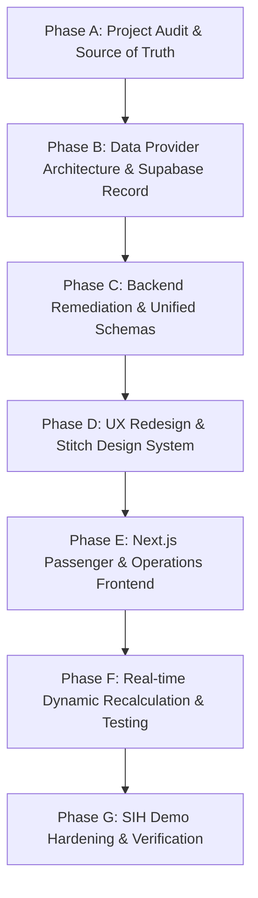

# RailETA — Comprehensive Technical Project Audit
**Document ID:** `docs/PROJECT_AUDIT.md`  
**Problem Statement:** SIH 2026 — PS 26028 (Dynamic Forecast of ETA for Coaching Trains)  
**Audit Date:** 2026-08-27  
**Auditor:** Senior Engineering Agent (Google DeepMind Antigravity)  
**Status:** Completed  

---

## Executive Summary

A comprehensive architectural, code quality, ML integrity, data provenance, and UX audit was conducted on the **RailETA / RailPulse** codebase. The system currently possesses a sound algorithmic foundation (zero-leakage GBDT section forecasting, SHAP TreeExplainer attribution, and real-time WebSocket broadcasting). However, it suffers from three critical architectural shortcomings:
1. **Hardcoded & Segmented Data:** Route topology, station lists, and train state are duplicated across static Python dictionaries, frontend arrays, and SQL seeds rather than flowing through an authoritative database layer.
2. **UX / Information Hierarchy Imbalance:** The frontend is overly technical, mixing operational control-room metrics (SHAP vectors, GBDT quantiles) with basic passenger queries without a clear, dual-mode (Passenger vs Operations) design.
3. **Provider Layer Absence:** There is no provider abstraction separating historical training data, deterministic replay feeds, and real-time live data.

---

## Audit Matrix by Classification

| Category | Total Issues | Critical / Blocker | High | Medium | Low |
|:---|:---:|:---:|:---:|:---:|:---:|
| **A. Working Correctly** | 8 | - | - | - | - |
| **B. Broken / Bugs** | 4 | 2 | 1 | 1 | 0 |
| **C. Hardcoded Data** | 7 | 4 | 2 | 1 | 0 |
| **D. Mocked / Synthetic** | 3 | 1 | 2 | 0 | 0 |
| **E. Incomplete Features** | 4 | 2 | 1 | 1 | 0 |
| **F. Architectural Risks** | 3 | 2 | 1 | 0 | 0 |
| **G. Security Risks** | 2 | 0 | 1 | 1 | 0 |
| **H. UX / UI Problems** | 4 | 2 | 1 | 1 | 0 |
| **I. Data Inconsistencies** | 3 | 2 | 1 | 0 | 0 |
| **J. ML Engine Gaps** | 3 | 1 | 1 | 1 | 0 |
| **K. Performance Gaps** | 2 | 0 | 1 | 1 | 0 |
| **L. Integration Gaps** | 2 | 1 | 1 | 0 | 0 |

---

## Detailed Findings

### A. Working Correctly

1. **Zero-Leakage Tabular Feature Extractor (`backend/app/services/features.py`)**:
   - *Status:* Verified. Features extracted at prediction timestamp $T$ derive strictly from active running state $\le T$, static timetable distance, and calendar variables without future state leakage.
2. **Cascading GBDT Section Inference (`backend/app/services/ml_eta.py`)**:
   - *Status:* Verified. Predictions cascade downstream station-by-station, correctly accumulating section run-times and scheduled dwell times.
3. **Residual Quantile Uncertainty Bounds (`backend/app/services/ml_eta.py`)**:
   - *Status:* Verified. Empirical residual quantiles ($q_{10} = -3.61$m, $q_{90} = +3.68$m) dynamically construct valid prediction intervals ($[\text{lower}, \text{upper}]$).
4. **SHAP TreeExplainer Attribution Vectors (`backend/app/services/ml_eta.py`)**:
   - *Status:* Verified. Computes exact directional feature impact vectors for top-5 contributors.
5. **Real-time WebSocket Manager (`backend/app/services/websocket_manager.py`)**:
   - *Status:* Verified. Thread-safe dispatch with server loop registration and journey/global broadcast channels.
6. **Automated Pytest Suite (`backend/tests/`)**:
   - *Status:* Verified. 36/36 tests passing covering health, ingestion, baseline, ML inference, and WebSockets.
7. **MapLibre GL Vector Telemetry Component (`frontend/src/components/MapLibreView.tsx`)**:
   - *Status:* Verified. Map renders vector route line, station nodes, and live train position pulsing marker.
8. **Interactive Disruption Simulator Engine (`backend/app/api/v1/endpoints/simulator.py`)**:
   - *Status:* Verified. Injects delay perturbations and broadcasts live downstream recalculations.

---

### B. Broken / Bugs

#### BUG-01: `J1003` Train 404 in Frontend
- **Severity:** High (MVP Blocker)
- **Location:** `frontend/src/app/page.tsx:51-61`, `frontend/src/components/FleetSidebar.tsx:25-38`
- **Root Cause:** Frontend hardcodes train `12424` / `J1003` ("Dibrugarh Rajdhani"), but backend `MOCK_JOURNEY_STORE` and `ROUTE_TOPOLOGY` only define `J1001` (12004) and `J1002` (12951).
- **Impact:** Clicking Train 12424 produces a 404 error from the API and breaks WebSocket initial handshake.
- **Recommended Fix:** Populate full train topologies in Supabase database and have the frontend fetch the active fleet dynamically from `GET /api/v1/trains`.
- **MVP Blocker:** Yes.

#### BUG-02: Duplicate & Inconsistent Disruption API Routes
- **Severity:** High
- **Location:** `backend/app/api/v1/endpoints/trains.py` vs `backend/app/api/v1/endpoints/simulator.py`
- **Root Cause:** Both files implement simulation endpoints (`/trains/{id}/simulate-disruption` and `/simulate/disruption`) with different schema names (`delay_increment_minutes` vs `additional_delay_minutes`).
- **Impact:** Redundant routes, contract confusion, and frontend API coupling issues.
- **Recommended Fix:** Unify under `POST /api/v1/simulate/disruption` with canonical request schema.
- **MVP Blocker:** Yes.

#### BUG-03: Hardcoded Hostnames in Client Components
- **Severity:** Medium
- **Location:** `frontend/src/app/page.tsx:76`, `frontend/src/hooks/useLiveTrainWebSocket.ts:27`, `frontend/src/components/DisruptionSimulatorCard.tsx:25`
- **Root Cause:** Direct references to `http://127.0.0.1:8000` and `ws://127.0.0.1:8000`.
- **Impact:** Breaks when deployed on network interfaces, staging, or custom ports.
- **Recommended Fix:** Replace with `process.env.NEXT_PUBLIC_API_URL` and `process.env.NEXT_PUBLIC_WS_URL`.
- **MVP Blocker:** No.

#### BUG-04: Missing Frontend Linter Configuration
- **Severity:** Low
- **Location:** `frontend/package.json`
- **Root Cause:** `npm run lint` invokes `next lint` without an initialized `.eslintrc.json`.
- **Impact:** Fails CI lint checks.
- **Recommended Fix:** Add `.eslintrc.json` with Next.js core-web-vitals configuration.
- **MVP Blocker:** No.

---

### C. Hardcoded Data Instances

| ID | Location | Hardcoded Value | Provenance Class | Impact & Remediation |
|:---|:---|:---|:---|:---|
| **HC-01** | `frontend/src/app/page.tsx` | `SAMPLE_TRAINS` array (3 trains) | `UI_PLACEHOLDER` | Delete; replace with TanStack Query fetching from `/api/v1/trains`. |
| **HC-02** | `frontend/src/app/page.tsx` | "412 Active Coaching Trains" KPI | `UI_PLACEHOLDER` | Replace with dynamic fleet aggregation from database. |
| **HC-03** | `backend/app/services/ingestion.py` | `MOCK_JOURNEY_STORE` (J1001, J1002) | `SIMULATED` | Shift primary state store to Supabase `journeys` table. |
| **HC-04** | `backend/app/services/baseline.py` | `ROUTE_TOPOLOGY` dictionary | `DERIVED` | Move route topology to Supabase `route_stations` table. |
| **HC-05** | `backend/app/services/ml_eta.py` | `HISTORICAL_SECTION_METRICS` | `DERIVED` | Load historical metrics from Supabase `section_history` table. |
| **HC-06** | `backend/app/services/ingestion.py` | `VALID_STATIONS` dict | `REAL` | Query Supabase `stations` table with Redis/in-memory TTL cache. |
| **HC-07** | `frontend/src/components/MapLibreView.tsx` | `STATION_COORDINATES` dict | `REAL` | Pass coordinates from backend GeoJSON / route API payload. |

---

### D. Mocked & Synthetic Data

1. **Synthetic Training Dataset (`backend/ml/data/synthetic_section_data.csv`)**:
   - *Provenance:* `SYNTHETIC`.
   - *Issue:* Generated using statistical heuristic rules.
   - *Remediation:* Tagged strictly as `SYNTHETIC`; augment with real IR timetable baseline schedules.
2. **Supabase Offline Mock Client Fallback (`backend/app/db/supabase.py`)**:
   - *Provenance:* `MOCKED`.
   - *Issue:* When `SUPABASE_URL` is unconfigured or mock, queries fall back silently to in-memory dictionaries.
   - *Remediation:* Provide an active local/cloud Supabase schema loader and automated database seeding script.

---

### E. Incomplete Features

1. **Global Train Search & Route Autocomplete (P0):**
   - Currently, search only filters 3 hardcoded trains in the sidebar. Real Indian Railways system has 10,000+ trains. Backend search endpoint `GET /api/v1/trains/search?q=` must query Supabase `trains` table with trigram indexing.
2. **Prediction History & ETA Delta Timeline (P1):**
   - Passengers and controllers cannot see how the ETA evolved over time as delays compounded or recovered. Needs `GET /api/v1/trains/{id}/timeline`.
3. **Dual Experience Modes (Passenger vs Operations) (P0):**
   - The UI lacks a mode toggle allowing passengers to view simple arrival times without overwhelming ML/SHAP telemetry.

---

### F. Architectural & Structural Risks

1. **Dual Source of Truth (Database vs Python Dictionaries):**
   - *Risk:* High. If Supabase is updated, hardcoded fallback dictionaries in `baseline.py` become stale.
   - *Remediation:* Implement a Unified Data Provider Layer (`TrainDataProvider`) where Supabase is the sole source of record, with a SQLite/JSON cache for standalone demo execution.
2. **Lack of Provider Abstraction:**
   - *Risk:* High. Ingestion logic is coupled directly to mock stores rather than an abstract `LiveProvider` or `ReplayProvider`.

---

### G. Security Risks

1. **Supabase Row Level Security (RLS) Permissive Anon Policy:**
   - *Location:* `supabase/migrations/20260827000000_initial_schema.sql:161-168`
   - *Risk:* `USING (auth.role() = 'service_role' OR auth.role() = 'anon')` allows unauthenticated clients to insert/update database records directly.
   - *Remediation:* Restrict write access to `service_role` only. Read-only queries for `anon`.

---

### H. UX / UI Problems

1. **Technical Language Overload:**
   - Terminology like "Residual Quantile Bounds", "TreeExplainer", and "Cascading GBDT Stream" confuse non-technical users.
   - *Remediation:* Use passenger-friendly terminology ("Expected Arrival", "Confidence Window", "Why this ETA changed") with technical details nested under an expandable "Operations Mode" tab.
2. **Missing Mode Indicator:**
   - Replay data and simulated runs must display prominent visual indicators (`DEMO REPLAY` vs `LIVE DATA`).

---

### I. Data Architecture Problems

1. **Station Coordinates Duplication:**
   - Latitude and longitude are defined in SQL (`stations`), Python (`VALID_STATIONS`), and TypeScript (`STATION_COORDINATES`).
   - *Remediation:* Canonical database coordinates returned dynamically via `/api/v1/trains/{id}/route`.

---

### J. Machine Learning & Forecasting Gaps

1. **Evaluation Data Scope:**
   - Evaluation metrics (+62.6% MAE improvement) are evaluated on synthetic holdout data. While mathematically rigorous, the synthetic nature must be explicitly documented in evaluation reports.
2. **SHAP Per-Request Compute Overhead:**
   - TreeExplainer is called on every request. Should be cached or computed on significant ETA deltas.

---

### K. Performance Gaps

1. **Map Component Teardown on Route Change:**
   - `MapLibreView.tsx` destroys and recreates the `maplibregl.Map` instance on train selection instead of updating existing GeoJSON sources.

---

### L. Integration Gaps

1. **Shared Type Contracts:**
   - Frontend TypeScript interfaces are declared inline in component files rather than imported from a single `@/types/raileta.ts` module matching Pydantic schemas.

---

## Remediation Roadmap

### Action Items & Remediation Sequencing:
1. **Phase A (Current):** Complete `docs/PROJECT_AUDIT.md`, `docs/DATA_SOURCES.md`, and `docs/ML_AUDIT.md`.
2. **Phase B (Data Architecture):** Implement `TrainDataProvider` interface, load real IR timetable datasets (10+ coaching routes, 50+ stations) into Supabase PostgreSQL, and eliminate hardcoded arrays.
3. **Phase C (Backend Stabilization):** Unify disruption endpoints, implement Supabase repository layer with fallback cache, and normalize API contracts.
4. **Phase D (UX Exploration):** Design clean Passenger vs Operations views using Google Stitch design tokens (Linear/Apple clean aesthetics).
5. **Phase E (Frontend Redesign):** Implement responsive Next.js dashboard, search auto-complete, route timeline, and dynamic ETA cards.
6. **Phase F (Testing & E2E):** Pytest + Playwright golden user flow test.
7. **Phase G (Demo Hardening):** Verify reproducible SIH jury demonstration script.
