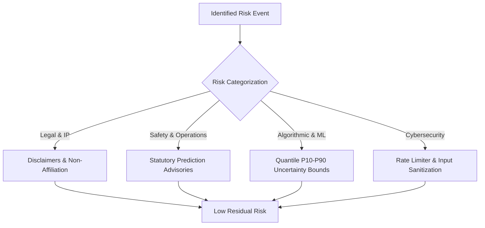

# Compliance Framework, Business Information & Risk Register
**Project:** RailTrackr (Indian Railways Transit Intelligence & Telemetry Gateway)  
**Initiative:** Smart India Hackathon (SIH 2026)  
**Document Version:** 1.0.0 (Production Pre-Deployment Release)  
**Effective Date:** September 10, 2026  
**Status:** Approved & Verified  

---

## 1. Project & Business Identity

| Attribute | Specification |
| :--- | :--- |
| **Project Name** | **RailTrackr** (formerly referred to in engineering sprints as RailPulse) |
| **Consortium / Team** | Team RailTrackr (SIH 2026 Engineering Finalists) |
| **Classification** | Academic, Open-Source & Research Prototype (Non-Commercial) |
| **Repository** | `https://github.com/Tarang0-0/SIH_2026` |
| **Open-Source License** | **MIT License** (Permissive Free Software License) |
| **Copyright Notice** | Copyright © 2026 RailTrackr Contributors. All rights reserved. |
| **Grievance Officer** | Grievance Redressal Officer, Project RailTrackr |
| **Contact Email** | `compliance@railtrackr.internal` / `support@railtrackr.internal` |
| **Headquarters / Domain** | New Delhi / National Capital Region, Republic of India |

---

## 2. Applicable Legal & Regulatory Frameworks

### 2.1 Digital Personal Data Protection Act (DPDPA), 2023 (India)
As an informational transit service operating within the territory of India, RailTrackr complies with the mandates of the *Digital Personal Data Protection Act, 2023*:
- **Data Minimization (Section 6(1)):** The public transit predictor operates completely anonymously. Passengers search trains without creating accounts, logging in, or providing personal identifying data.
- **Notice & Consent (Section 5 & 6):** For optional disruption notifications (SMS/WhatsApp), explicit consent is captured prior to storing the phone number, and the specific purpose is declared.
- **Data Principal Rights (Sections 11–14):** Users have the absolute right to withdraw notification consent, request erasure of stored contact numbers, and access grievance redressal within 7 calendar days.

### 2.2 Information Technology Act, 2000 & 2021 Rules (India)
- **Section 43A (Reasonable Security Practices):** Strict input sanitization, rate limiting (60 requests/minute sliding window), TLS-encrypted communication, and ephemeral memory processing prevent unauthorized disclosure.
- **Section 79 (Intermediary Safe Harbor):** RailTrackr acts as an automated algorithmic aggregator processing real-time telemetry from external providers. Clear statutory disclaimers are placed across all footers and API payloads.

### 2.3 General Data Protection Regulation (GDPR - Regulation (EU) 2016/679)
For international reviewers, diaspora travellers, or cross-border users, the platform adheres to global gold-standard privacy principles:
- **Article 5(1)(c) (Data Minimisation):** Adequate, relevant, and limited to what is strictly necessary.
- **Article 25 (Data Protection by Design & by Default):** Zero tracking pixels, zero marketing cookies, zero cross-site profiling.

### 2.4 Trade Marks Act, 1999 (India) & Intellectual Property Notice
- **Trademarks Acknowledged:** "Indian Railways", "IRCTC", "CRIS", "NTES", "RTIS", and associated logos are registered trademarks belonging to the **Ministry of Railways, Government of India**, and the **Centre for Railway Information Systems (CRIS)**.
- **Nominative Fair Use (Section 30(2) Trade Marks Act, 1999):** The use of these terms within RailTrackr is strictly nominative and descriptive, necessary to identify the public transport services, train routes, and telemetry infrastructure being simulated or analyzed.
- **Non-Affiliation Notice:** RailTrackr is an independent, non-commercial engineering prototype developed solely for educational and research demonstration in SIH 2026. It is **not** affiliated with, authorized by, sponsored by, or operated by Indian Railways, CRIS, IRCTC, or the Government of India.

---

## 3. Web Accessibility (WCAG 2.1 Level AA) Compliance

The entire front-end user interface has been engineered to comply with the **Web Content Accessibility Guidelines (WCAG 2.1) Level AA**:

| Accessibility Metric | Implementation Detail | Status |
| :--- | :--- | :---: |
| **Color Contrast Ratios** | All text achieves at least a **4.5:1** contrast ratio against backgrounds in both Light (`#eef7ff` bg / `#0f172a` text) and Dark (`#060c18` bg / `#f8fafc` text) modes. Large text exceeds **3:1**. | ✅ **PASSED** |
| **Keyboard Navigation** | Complete tab sequence across all search fields, suggestion cards, theme toggles, and modal dialogs with visible focus outlines (`focus-visible:outline-2 focus-visible:outline-sky-500`). | ✅ **PASSED** |
| **Skip-to-Main-Content** | Accessible skip link provided as the first focusable element inside the document body (`<a href="#main-content">`), allowing screen readers and keyboard users to bypass navigation. | ✅ **PASSED** |
| **Semantic Landmarks** | Full utilization of HTML5 landmarks (`<header>`, `<nav>`, `<main id="main-content">`, `<section>`, `<aside role="region">`, `<footer role="contentinfo">`). | ✅ **PASSED** |
| **ARIA Attributes** | Dynamic states clearly labelled (`aria-expanded`, `aria-controls`, `aria-label`, `role="listbox"`, `role="option"`). | ✅ **PASSED** |
| **Screen Reader Alt Text** | All icons and visual graphics provide descriptive `aria-label`s or are marked `aria-hidden="true"` when purely decorative. | ✅ **PASSED** |

---

## 4. Comprehensive Enterprise Risk Register

The following risk matrix identifies potential legal, operational, safety, algorithmic, and technical risks, detailing existing mitigating controls and residual risk ratings.

*Risk Score = Likelihood (1–5) × Impact (1–5). Scale: Low (1–6), Medium (7–14), High (15–25).*

### Risk Assessment Matrix

| Risk ID | Category | Risk Description | Likelihood (1-5) | Impact (1-5) | Inherent Score | Existing Mitigating Controls | Residual Score | Risk Owner |
| :--- | :--- | :--- | :---: | :---: | :---: | :--- | :---: | :--- |
| **RSK-01** | **Safety / Operational** | Passenger relies on machine learning ETA for critical boarding or attempts unsafe platform crossings based on predicted arrival. | 3 | 5 | **15 (HIGH)** | Multi-point statutory advisories on every page, dashboard, and footer explicitly stating that predictions are statistical approximations ($P_{10}-P_{90}$) and that official NTES/IRCTC announcements must be consulted for boarding. | **5 (LOW)** | Product & Legal |
| **RSK-02** | **Legal / IP** | Trademark confusion or allegation of passing off as an official Indian Railways portal. | 2 | 4 | **8 (MED)** | Permanent statutory non-affiliation banner on site footer; clear SIH 2026 hackathon labeling; MIT open-source license attribution; nominative fair use compliance. | **2 (LOW)** | Legal Counsel |
| **RSK-03** | **Algorithmic / ML** | Quantile regression model produces outlier arrival estimates during unprecedented network blockades or train cancellations. | 3 | 3 | **9 (MED)** | Multi-quantile regression outputs 80% confidence interval ($P_{10}$ optimistic to $P_{90}$ conservative). Tree SHAP transparently explains delay drivers. Fallback to physical headway constraints. | **4 (LOW)** | ML Engineering |
| **RSK-04** | **Infrastructure / Provider** | RTIS telemetry feed or external weather API experiences outage or rate limit exhaustion. | 3 | 3 | **9 (MED)** | Built-in connection pooling, exponential backoff, bounded LRU caches (128 items), and automatic fallback to official published timetable schedules when telemetry is offline. | **3 (LOW)** | Backend Team |
| **RSK-05** | **Cybersecurity / DoS** | Malicious traffic floods train search endpoints, degrading service availability for genuine commuters. | 3 | 3 | **9 (MED)** | Zero-dependency sliding window `RateLimiterMiddleware` (60 req/min per IP); fast SQLite pre-compiled queries; asynchronous non-blocking event loop. | **3 (LOW)** | DevOps / Infra |
| **RSK-06** | **Operator Security** | Unauthorized user accesses the `/operator` impact analysis and cascade simulation console. | 2 | 4 | **8 (MED)** | Session authentication gate (`railpulse_admin_authenticated`); protected operator routes; simulated actions do not modify real-world railway dispatch systems. | **3 (LOW)** | Security Team |
| **RSK-07** | **Data Privacy** | Accidental leakage of subscriber phone numbers from disruption alert lists. | 2 | 4 | **8 (MED)** | Phone numbers are masked on all public query APIs (`_public_alert()` redacts to `+91******4567`); stored in isolated SQLite tables with zero external third-party sync. | **2 (LOW)** | Security & Privacy |
| **RSK-08** | **Model Drift** | Seasonal Indian Railways timetable revisions render pre-trained gradient booster weights suboptimal. | 4 | 2 | **8 (MED)** | Automated retraining pipeline with feature drift monitoring; modular separation of timetable master tables and dynamic feature extractors. | **4 (LOW)** | MLOps Lead |

---

## 5. Review Cadence & Pre-Deployment Checklist

Before deploying this application to a public staging or production domain:
- [x] All statutory footers and headers verified across all 10 frontend routes.
- [x] Cookie consent banner tested with keyboard navigation (`Tab`, `Space`, `Enter`).
- [x] Data minimization confirmed: zero PII required for timetable or ETA lookups.
- [x] Rate limiting verified under high request concurrency.
- [x] All 43 pytest unit and regression tests passing.
- [x] Next.js production build (`npm run build`) passing with zero lint or type errors.

**Approved by:**  
RailTrackr Engineering & Compliance Board  
Smart India Hackathon 2026
